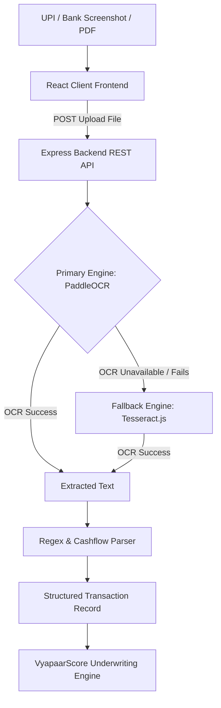

# 🛍️ VyapaarScore: AI Micro-Business Credit Evaluation & Underwriting Platform

**VyapaarScore** is an AI-powered alternative credit scoring and underwriting engine tailored specifically for micro-merchants, Kirana store owners, and MSMEs in India who lack traditional credit bureau scores (CIBIL/Equifax). By leveraging Optical Character Recognition (OCR) on digital UPI QR payment receipts (PhonePe, Google Pay, Paytm, BharatPe) and bank SMS notifications, VyapaarScore calculates a dynamic, transparent credit score ranging from **300 to 900** alongside micro-credit limit estimations.

---

## 🌟 Key Features

- **🔐 Secure Authentication & 2FA**:
  - Role-Based Access Control (**Merchant**, **Lender**, **System Admin**).
  - Mandatory **2FA Email OTP Verification** powered by Nodemailer.
  - Password Hashing using `bcryptjs` and Session Management with `JSON Web Tokens (JWT)`.

- **📸 Automated Dual-Engine OCR Ingestion**:
  - **Primary Engine**: **PaddleOCR** (Baidu AI Deep Learning) optimized for Indian payment receipt screenshots & complex text layouts.
  - **Fallback Engine**: **Tesseract.js** for client/standalone execution if PaddleOCR is unavailable.
  - **PDF Document Engine**: `pdf-parse` for bank statement e-receipts.
  - Automatically extracts **Transaction Amount**, **Date**, **Counterparty Name**, **Type (Credit/Debit)**, and **Category**.

- **📊 300 - 900 VyapaarScore Algorithm**:
  - Transparent cashflow velocity engine analyzing **Inflow Volume**, **Net Cashflow Balance**, **Transaction Consistency**, and **Expense Ratios**.
  - Dynamic **Risk Tier Classification** (Tier A to Tier D) and estimated micro-credit limit (up to ₹5,00,000).

- **📄 Official PDF Credit Report Generation**:
  - Dynamic generation of downloadable, official PDF credit evaluation summaries via **PDFKit**.
  - Complete with digital verification stamp, financial breakdown, and transaction ledger.

- **🏦 NBFC Lender Underwriting Portal**:
  - Lenders evaluate opt-in merchant credit profiles.
  - One-click loan application approvals and rejections with automated email notifications.

- **🛡️ Platform Administration**:
  - Admin dashboard monitoring total users, active merchants, lenders, parsed receipts, and system metrics.
  - Dynamic user role management.

---

## ⚙️ Technology Stack

| Layer | Technology Used |
| :--- | :--- |
| **Frontend Framework** | React.js (Vite) |
| **Styling & Icons** | Tailwind CSS, Lucide React |
| **State & Navigation** | React Router v6, Context API (`AuthContext`, `ThemeContext`) |
| **Backend Framework** | Node.js, Express.js |
| **Database & ORM** | MongoDB, Mongoose |
| **Primary OCR Engine** | PaddleOCR (Baidu AI Deep Learning) |
| **Fallback OCR Engine** | Tesseract.js |
| **PDF Document Engine** | PDF-Parse |
| **PDF Generation** | PDFKit |
| **Security & Email** | JWT, bcryptjs, Express Rate Limit, Nodemailer |

---

## 🏗️ End-to-End Workflow & Dual-Engine OCR Architecture



### 🎓 Viva Project Explanation
> **“We selected PaddleOCR as the primary OCR engine because it provides better OCR performance for transaction screenshots and complex text layouts. Tesseract.js is used as a fallback mechanism if PaddleOCR is unavailable.”**

---

## 📐 Credit Scoring Model & Mathematical Formula

$$\text{VyapaarScore} = 300 + \text{Inflow Points} + \text{Net Cashflow Points} + \text{Frequency Points} + \text{Expense Ratio Points}$$

| Parameter | Weight | Description |
| :--- | :--- | :--- |
| **Base Score** | `300 pts` | Fixed starting baseline score |
| **Inflow Volume** | `Max 250 pts` | Scaled from ₹0 (0 pts) up to ₹50,000+ monthly digital sales (250 pts) |
| **Net Cashflow** | `Max 150 pts` | Positive surplus of Total Sales Inflow over Total Operating Expenses |
| **Transaction Frequency** | `Max 100 pts` | 10 pts per parsed receipt document (Up to 10+ receipts) |
| **Expense Management** | `Max 100 pts` | Healthy margin ratio of income vs expenses |

### Risk Tiers & Credit Limits
- 🟢 **Tier A - Low Risk (Score 750–900)**: Credit Limit up to ₹5,00,000
- 🔵 **Tier B - Moderate Risk (Score 680–749)**: Credit Limit up to ₹2,50,000
- 🟦 **Tier C - Fair Stability (Score 600–679)**: Credit Limit up to ₹1,00,000
- 🟡 **Tier D - Building History (Score 300–599)**: Baseline Limit ~₹25,000

---

## 🗄️ Database Schemas

### 1. `User` Schema
- `name`, `businessName`, `email`, `phone`, `password`, `role` (`merchant` | `lender` | `admin`), `isVerified`, `otpHash`, `otpExpiresAt`, `isSharedWithLenders`.

### 2. `Transaction` Schema
- `userId` (ref: `User`), `date`, `counterparty`, `amount`, `type` (`credit` | `debit`), `category` (`Sales` | `Supplies` | `Utilities` | `Personal` | `Other`), `source` (`ocr_image` | `sms_text` | `manual`), `rawText`, `fileName`.

### 3. `LoanApplication` Schema
- `merchantId` (ref: `User`), `lenderId` (ref: `User`), `creditScore`, `requestedAmount`, `status` (`pending` | `approved` | `rejected`), `lenderNotes`.

### 4. `ScoreHistory` Schema
- `userId` (ref: `User`), `score`, `riskGrade`, `totalInflow`, `totalOutflow`, `netCashflow`, `transactionCount`, `triggerSource`.

---

## 📡 API Endpoints Reference

### 🔐 Authentication (`/api/auth`)
- `POST /api/auth/signup`: Register new account & send 2FA OTP.
- `POST /api/auth/verify-otp`: Verify 6-digit OTP code & return JWT token.
- `POST /api/auth/resend-otp`: Request fresh OTP.
- `POST /api/auth/login`: Authenticate email/password & trigger 2FA OTP.
- `POST /api/auth/forgot-password`: Request password reset OTP.
- `POST /api/auth/reset-password`: Reset password with valid OTP.
- `GET /api/auth/me`: Fetch authenticated user profile.
- `POST /api/auth/update-profile`: Update name, business name, or phone.
- `POST /api/auth/change-password`: Update account password.

### 📷 Document Processing & OCR (`/api/upload`)
- `POST /api/upload`: Upload image screenshot or bank SMS text for OCR parsing.
- `POST /api/upload/confirm`: Confirm and persist extracted transactions to MongoDB.

### 📊 Reports & Score Analytics (`/api/reports`)
- `GET /api/reports/my-score`: Calculate and return merchant credit score & history timeline.
- `PUT /api/reports/share-toggle`: Enable/disable sharing credit report with lenders.
- `GET /api/reports/pdf`: Generate & stream official PDF credit report.
- `GET /api/reports/lender/merchants`: Fetch all opt-in merchant credit reports (Lender role).
- `POST /api/reports/lender/decision`: Record loan application decision (Approve/Reject) & notify merchant.

### 💳 Transactions Ledger (`/api/transactions`)
- `GET /api/transactions`: Fetch paginated transactions with search and filter.
- `GET /api/transactions/stats`: Summary metrics for merchant dashboard.
- `DELETE /api/transactions/:id`: Remove transaction record.

### 👑 System Admin (`/api/admin`)
- `GET /api/admin/users`: View all platform users and system statistics.
- `PUT /api/admin/users/:id/role`: Modify user access role.

---

## 🚀 Setup & Installation Guide

### Prerequisites
- **Node.js**: v18.x or later
- **MongoDB**: Local MongoDB instance or MongoDB Atlas Connection URI

### 1. Environment Configuration

Create a `.env` file inside the `server/` directory:

```env
PORT=5000
MONGO_URI=mongodb://localhost:27017/vyapaarscore
JWT_SECRET=your_vyapaarscore_jwt_secret_key_2026
NODE_ENV=development

# Email Transporter (SMTP Setup for 2FA OTP)
EMAIL_SERVICE=gmail
EMAIL_USER=your_email@gmail.com
EMAIL_PASS=your_gmail_app_password
```

### 2. Backend Setup & Run

```bash
cd server
npm install
npm run dev
```
Backend will run at: `http://localhost:5000`

### 3. Frontend Setup & Run

```bash
cd client
npm install
npm run dev
```
Frontend will run at: `http://localhost:5173`

---

## 🛡️ Security Best Practices

1. **Rate Limiting**: Auth endpoints limited to 30 requests/15 minutes; general API limited to 300 requests/15 minutes using `express-rate-limit`.
2. **Password Hashing**: Passwords salted and hashed with `bcryptjs` (10 rounds).
3. **Strict 2FA**: Every user login and registration requires active 6-digit email OTP verification.
4. **Data Privacy**: Credit reports shared with lenders strictly based on merchant's explicit consent toggle (`isSharedWithLenders`).
